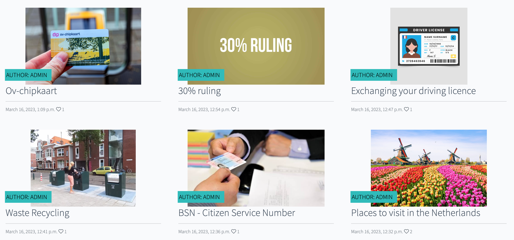

# NaijaNetherlands

* # Introduction
    NaijaNetherlands is a full-stack framework project built using Django, Bootstrap,Python,Html, Css and Javascript
    This is a blog website designed for Nigerian expats living in Netherlands. They should find useful information that allows them to adjust to the lifestyle in the Netherlands.
    

* ## Live Preview   
    * ### For a live preview click: [NaijaNetherlands](https://herokuapp.com/)

* ## Table of Contents
* [SiteGoals](#SiteGoals)
* [UX](#ux)
    * [Entity Relationship Model](#entity-relationship-model)
    * [Agile Methodology](#agile-methodology)
    * [Color Scheme](#color-scheme)
    * [User Stories](#user-stories)
    * [Admin Stories](#admin-stories)
    * [Wireframes](#wireframes)

* [Features](#features)
    * [Existing Features](#existing-features)
    * [Future Features](#future-features)

* [Testing](#testing)

* [Bugs](#bugs)
    
    * [Fixed Bugs](#fixed-bugs)

* [Technologies Used](#technologies-used)

    * [Languages Used](#languages-used)
    * [Libraries/Framework Used](#librariesframework-used)
    * [Other Technologies](#other-technologies)

* [Deployments](#deployments)

    * [Heroku](#heroku)
    * [Github](#github)

* [Credits](#credits)

* # Site Goals
 The goal of the site is to give Nigerian expats the relevant information needed to live susutainably in the Netherlands through blog posts.
 Users of the site shold easily read blog posts and comment on the different posts.

* # UX

    * ## Entity Relationship Model
        * Before I started this project, I created a relationship entity for a Django app, which helped me determine what models fields are needed for this project.

        

    * ## Agile Methodology
        * This project was created using the agile methodology and github issue boards.

            

            

    
    * ## Color Scheme
        * Based on the  goal of the website I decided to use a touch of Nigerian and Netherlands color green, red and white.

        

    * ## User Stories
        * As a site user:
        * I want to read different posts on the site.
        * I want to comment on the post.
        * I want to like the comment.
        * I want to edit the comment.
        * I want to delete the comment.
        * I want to sign up, sign in as a user.
        * I want to login & logout
        

    * ## Admin Stories 
        * As a site admin:
        * I want to create drafts.
        * I want to create new post on the website.
        * I want to read new post.
        * I want to update a post.
        * I want to approve comments
        * I want to delete comments.

    * ## Wireframes
    * Project wireframe was created by using 
        

* # Features 

    * ## **Home Page**
    * ### **Navigation Bar** 
        * The navigation bar is featured on all the pages on the website. It includes the website name, link to the home page, about page, register and login page.
        * This allows users to move through the different pages.

        
            
    * ### **Landing Page**  
        * The landing page includes a photograph with a text attached to the left. It is fully responsive.
        * It has a read more button overlay which will work in the future. 

          

    * ### **Blog Posts**  
        * There are 6 different blog posts for the user to read through. 
        * Each post has a title, author,datecreated and a like button attached to it with a link to another page to read the post. 

            
    
    * ### **Comment signin**  
        * Below the post story the new user is asked to signin/ register before they can leave a comment.

              

        * Upon signup/signin the user can leave a comment.
              

    * ### **Comment Approval**
        * There is a notification that shows after the user has submitted a comment.

              

      * ### **Django admin** 
      * This is the django admin terminal that allows the admin/author to login with the superuser created.
       

        * ### **Django administration** 
      * This is the django admin terminal that allows the admin/author to create posts/drafts, approve and delete comments.
       

  
    * ### **About Page**
        * Users will not have access to appointment form, they will be asked to `login/register` first.    

              

        
   * ### **Registration Page**
        * New users will be asked to sign in.
        * When users have successfully registered with the website, they will be directed to the home page and see successfully signed in.  

            

       
    * ### **Signin Page**
        * Logged in users have access to the page, so users don't need to register to leave comments. 

        * Upon confirming signing in , the user will be logged in the website, and a pop-up model will display the message `You have successfully signed in`, which will disappear after 3 seconds.
            
 

    * ### **Logout Page**
        * `django-allauth` library was used to handle all the messages and errors for `login`, `register` and `logout` page.
        * Logged in users will not see a registration or login button. Instead, they will see a logout button in the navbar, and clicking that will prompt them to confirm that they wish to logout.  

        * Upon confirming sign out, the user will be logged out from the website, and a pop-up model will display the message `You have signed out`, which will disappear after 3 seconds.
            

    * ### **Footer**  
        * All the users will have access to the footer section of the page, where they can find information on all the social media handles. 
            

    * ## **Future Features**
        * The readmore button will link to the posts.
        * To make signing up easier for new users, I would like to add an option of a one-click signup button where users who already have an account with Google or Facebook, can sign up by simply clicking on Google or facebook.  
        * A contact page will be created.
        * Community groups will be created to allow users in the same provinces conect.

* # Testing

*  Due to constraints of time I haven't had the time to test to ensure the website's functionality meets the desired intent.

* # Bugs

* Multiple bugs were encountered during the development stage.

    * ### Fixed Bugs
        * First issue encounterd was the secret key improperly configured.
        
        * Whilst creating the delete comments, I had this issue.
        

        
* # Technologies Used

    * ## Languages Used
        * [HTML](https://www.w3schools.com/html/)
        * [CSS](https://www.w3schools.com/css/)
        * [Javascript](https://en.wikipedia.org/wiki/JavaScript)
        * [Python](https://www.python.org/)

    * ## Libraries/Framework Used
        * [Django](https://www.djangoproject.com/)
        * [Bootstrap](https://getbootstrap.com/)
        * [jQuery](https://jquery.com/)

    * ### Libraries/Module Installed
        * asgiref==3.5.2
        * cloudinary==1.29.0
        * dj-database-url==1.0.0
        * dj3-cloudinary-storage==0.0.6
        * Django==3.2.15
        * django-allauth==0.51.0
        * django-bootstrap-datepicker-plus==4.0.0
        * django-bootstrap4==22.2
        * django-crispy-forms==1.14.0
        * django-phonenumber-field==7.0.0
        * gunicorn==20.1.0
        * oauthlib==3.2.1
        * phonenumbers==8.12.56
        * psycopg2==2.9.3
        * PyJWT==2.5.0
        * pylint-plugin-utils==0.7
        * python3-openid==3.2.0
        * pytz==2022.2.1
        * requests-oauthlib==1.3.1
        * sqlparse==0.4.2
        * types-cryptography==3.3.23

    * ## Other Technologies
        * [Postgres Database](https://www.postgresql.org/)
        * [W3School](https://www.w3schools.com/)
        * [Stackoverflow](https://stackoverflow.com/)
        * [Git](https://git-scm.com/)
        * [Github](https://github.com/)
        * [Gitpod workspace](https://gitpod.io/workspaces)
        * [Heroku](https://dashboard.heroku.com/apps)
        * [Flowchart](https://lucid.app/documents#/documents?folder_id=home)
        * [Balsamiq Wireframes](https://balsamiq.com/wireframes/)
        * [jshint](https://jshint.com/)
        * [HTML code validator](https://validator.w3.org/)
        * [CSS code validator](https://jigsaw.w3.org/css-validator/)
        * [Font Awsome](https://fontawesome.com/)
        * [Google Fonts](https://fonts.google.com/)
        * [Slack](https://slack.com/intl/en-gb/)
        * [geeksforgeeks](https://www.geeksforgeeks.org/)

* # Deployments
* Git and GitHub are used for version control. Python is the backend language, and can't be displayed with GitHub alone, To live preview my project, I used Heroku.

* ## Heroku
    * ### Deployment Steps On Heroku.
        * In my project i've used Django v3.2, so I used this command `pip3 install 'django<4' gunicorn` to install django.
        * So inside the terminal added these libraries:  
        `pip3 install dj_database_url psycopg2`,  
        `pip3 install dj3-cloudinary-storage`
        * Created requirements.txt file where I can save all the libraries i've installed:  
        `pip3 freeze --local > requirements.txt`
        * To create my project typed this command:  
        `django-admin startproject naijanetherlands
        * To create my app:  
        `python3 manage.py startapp blog`

        * to make this app work, Into the setting.py file inside `INSTALLED_APPS` added `blog`
        * to migrate changes typed this command:  
        `python3 manage.py migrate`
        * to run the test if the project is working `python3 manage.py runserver`

        * When deploying for the first time on Heroku, you must first register with Heroku.
        * Create your project name and location.
        * To add Database into the app, Locate in the Resources Tab, Add-ons, search and add 'Heroku Postgres'
        * Copy DATABASE_URL value, by going into the Settings Tab, click reveal Config Vars, Copy Text
        * In your workspace Create new env.py file.
        * Import os library:  
            `import os`
        * Set environment variables:  
            `os.environ["DATABASE_URL"] = "Heroku DATABASE_URL"`
        * Add in secret key:  
            `os.environ["SECRET_KEY"] = "mysecretkey"`
        * Add Secret Key to Config Vars in Heroku settings:  
            `SECRET_KEY, "mysecretkey"`

        * Add env.py file to the settings.py file:  
            `import os`  
            `import dj_database_url`

            `if os.path.isfile("env.py"):`  
                `import env`
        * Remove the insecure secret key and replace - links to the SECRET_KEY variable on Heroku:  
            `SECRET_KEY = os.environ.get('SECRET_KEY')`

        * Comment out the old DATABASES variable in setting.py file and add this instead:  
            `DATABASES = { 'default': dj_database_url.parse(os.environ.get("DATABASE_URL"))}`

        * Save all files and Make Migrations:  
            `python3 manage.py migrate`

        * Make account with Cloudinary To get static and media files.
        * From Cloudinary Dashboard, Copy your `CLOUDINARY_URL`:  
        * Add Cloudinary URL to env.py file:  
            `os.environ["CLOUDINARY_URL"] = "cloudinary://************************"`

        * Add Cloudinary URL to Heroku Config Vars:  
            `"cloudinary://************************"`

        * Temperoily add DISABLE_COLLECTSTATIC inside the heroku config Vars:  
            `DISABLE_COLLECTSTATIC, 1`

        * Add Cloudinary Libraries to settings.py installed apps:  
            `INSTALLED_APPS = ['cloudinary_storage', 'django.contrib.staticfiles', 'cloudinary']`

        * in the settings.py file under the `STATIC_URL = 'static/'` add:  
            `STATICFILES_STORAGE = 'cloudinary_storage.storage.StaticHashedCloudinaryStorage'`  
            `STATICFILES_DIRS = [os.path.join(BASE_DIR, 'static')]`  
            `STATIC_ROOT = os.path.join(BASE_DIR, 'staticfiles')`  

            `MEDIA_URL = '/media/'`  
            `DEFAULT_FILE_STORAGE = 'cloudinary_storage.storage.MediaCloudinaryStorage'`  

        * Place under the BASE_DIR line in settings.py:  
            `TEMPLATES_DIR = os.path.join(BASE_DIR, 'templates')`

        * Change the templates directory to TEMPLATES_DIR Place within the TEMPLATES array:  
            `TEMPLATES = [{'DIRS': [TEMPLATES_DIR],],},},]`

        * Add Heroku Hostname to ALLOWED_HOSTS:  
            `ALLOWED_HOSTS = [".herokuapp.com", "localhost"]`

        * Create 3 new folders on top level directory:  
            media, static, templates

        * Create Procfile on the top level directory and inside the file add this:  
            `web: gunicorn naijanetherlands.wsgi`
        
        * X_FRAME_OPTIONS = 'SAMEORIGIN'
        
        * before deploying on heroku make sure: 
            `DEBUG = False`
            Remove `DISABLE_COLLECTSTATIC` from the config vars.
        

* ## Github
    * ### Commit On Github:
        * To make my project I used gitpod worskspace, where first save all the files.
        * Then in the terminal type `git add .` to add all the changes inside the staging area.
        * The next step was `git commit -m "changes I made"` where I confirmed that what changes I want to make.
        * Last but not least, I have typed `git push` to save everything on Github.

* # Credits
    * ## Content
         * The post content and images were taken from these sites:
         https://expatax.nl/30-percent-ruling/
         (https://www.expatica.com/nl/living/household/recycling-in-the-netherlands-133948/)
         (https://allaboutexpats.nl/citizen-service-number/)
         (https://allaboutexpats.nl/about-the-30-facility/)
         (https://www.europeanbestdestinations.com/destinations/netherlands/best-places-to-visit-in-the-netherlands/)
         (https://www.amsterdamtips.com/ov-chipkaart)
         (https://www.amsterdam.nl/en/civil-affairs/passport-id/exchange-foreign/)

        * How to create post,postdetail, create comments, likes were done using the Django admin panel with help from the Code Institute's [Django blog walkthrough](https://github.com/Code-Institute-Solutions/Django3blog/tree/master/12_final_deployment) project.

        * In designing the nav bar and landing page using bootstrap, this was taken from YouTube [Bootstrap Nav](https://www.youtube.com/watch?v=4sosXZsdy-s&t=1584s).

        * How to delete ccomments on a post was taken from this site [youtube tutorial](https://www.youtube.com/watch?v=M_OKJnIdYeU&t=1772s) in preparation for this project.
        * By making this project I had help from my husband,tutor support and mentor.
        * In order to find a solution to a problem, I often search [Stackoverflow](https://stackoverflow.com/) and [geeksforgeeks](https://www.geeksforgeeks.org/).
        * In order to give me an idea of how a readme file should look, I looked at the Code Institute readmefile on slack, some other students project readme files
         [daisygunn](https://github.com/daisygunn/grow-restaurant) and [hash](https://github.com/hashim222/hash-dental-care).

